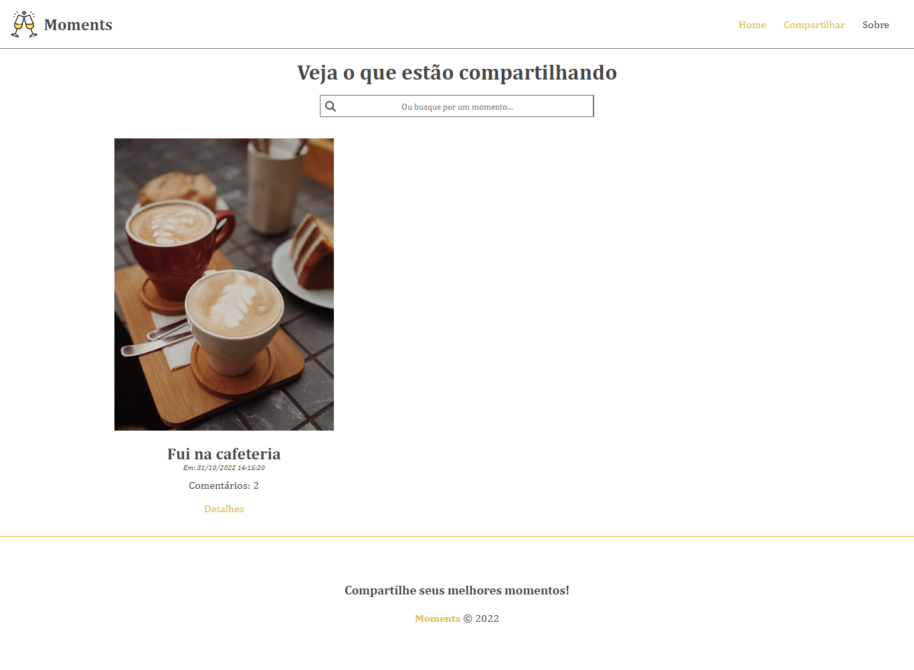
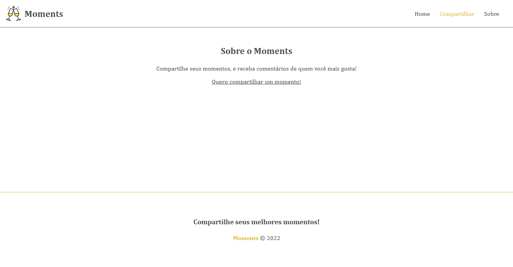
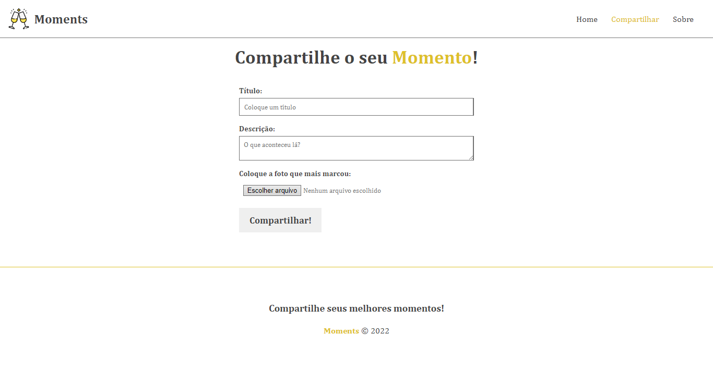
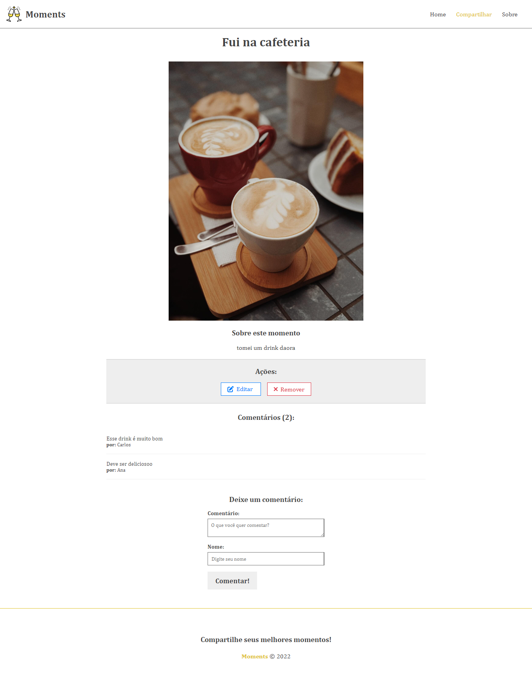

# Moments

## Uma mini rede-social para compartilhar momentos e enviar comentários

Projeto feito para praticar Angular (formulários, paginação e requisições) desenvolvimento no curso de Angular do Professor Matheus Basttisti  
[Link do curso](https://www.youtube.com/playlist?list=PLnDvRpP8Bnex2GQEN0768_AxZg_RaIGmw)

### Home

### Sobre

### Compartilhar

### Detalhe do momento

